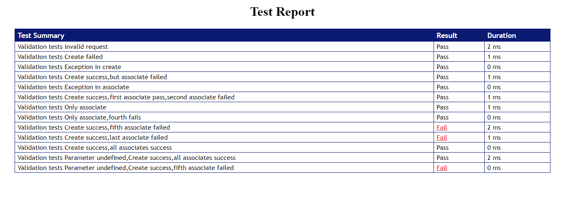

## mocha-html-single-reporter
A simple reporter for mocha that publishes results as a single html file and can be viewed without a server.
This can be easily integrated with CI system.

## Install
```
npm i mocha-html-single-reporter
```

## Usage
```
mocha --reporter mocha-html-single-reporter
```
A 'testreport.html' file will get generated which will have the pass/fail details.
Also,gives the details of the error in a popup window on clicking the 'Fail' cases link.

## Sample Report


